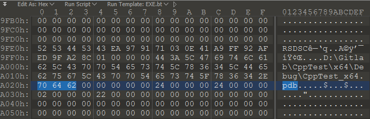
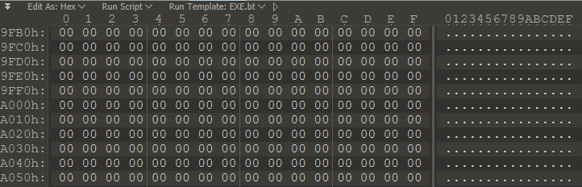

# PECleaner

Portable executable files leak information about the compiler, author, and build environment in the form of a RICH header. This tool removes the RICH header from x86/x64 PE files. Simple.

## Usage

1. Open the test file `tests\CppTest_x64_DEBUG.exe` in a hex editor and look at the RICH header.

Run PECleaner on the test file.

`.\PeCleaner.exe ..\tests\CppTest_x64_DEBUG.exe`

---
# Example

Before (partial) This portion of the rich header contains environment specific information.

After

